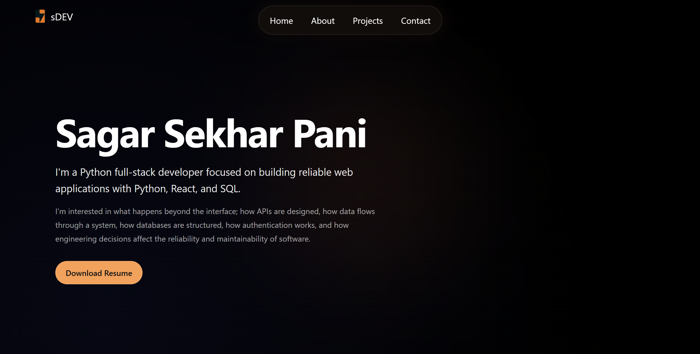

# Landing Page Demo

A responsive landing page built with semantic HTML5 and modern CSS, focused on responsive layout, accessibility, SEO metadata, and maintainable frontend structure.

## Live Demo

**Live:** [Landing Page Demo](https://sagarpani.github.io/frontend-landing-page-demo/)

## Preview





---

## Overview

This project is a frontend-focused landing page created to strengthen my understanding of HTML and CSS beyond simply making a page look good.

The implementation focuses on:

- Semantic HTML structure
- Responsive layouts
- Accessible navigation and interactive elements
- Modern CSS layout techniques
- Responsive typography
- CSS custom properties
- Visual hierarchy and spacing
- SEO metadata
- Open Graph metadata
- Progressive enhancement
- Responsive navigation behavior

The project intentionally avoids JavaScript for the core experience.

---

## Why I Built This

I built this project while strengthening my frontend fundamentals before moving deeper into React and backend development.

Rather than treating HTML and CSS as purely visual tools, I wanted to understand how structural decisions affect:

- accessibility
- responsiveness
- maintainability
- search-engine interpretation
- social sharing
- user experience

This project therefore serves as both a landing page and a practical exercise in frontend engineering fundamentals.

---

## Features

### Responsive Layout

The page adapts across desktop, tablet, and mobile screen sizes using CSS media queries.

The layout changes include:

- responsive grids
- mobile navigation
- flexible content widths
- responsive typography
- mobile-specific spacing
- responsive project cards

### Semantic HTML

The page uses semantic elements such as:

```html
<header>
<nav>
<main>
<section>
<article>
<footer>
```

This provides a clearer document structure for browsers, assistive technologies, and other tools that interpret the page.

### Responsive Navigation

The navigation uses a floating navigation island with a responsive mobile layout.

On supported browsers, CSS scroll-driven animation progressively changes the navigation behavior as the page is scrolled.

The implementation also uses:

```css
@supports (animation-timeline: scroll())
```

so browsers that do not support scroll-driven animations can continue using the base navigation layout.

### Accessibility Considerations

Accessibility was considered during the HTML and CSS implementation.

Examples include:

- semantic HTML elements
- descriptive image `alt` text
- accessible navigation labels
- keyboard-visible focus states
- appropriate heading hierarchy
- sufficient interactive target sizing
- avoiding JavaScript-dependent navigation for the core experience

### SEO Metadata

The document includes basic metadata intended to provide search engines with useful information about the page.

This includes:

- page title
- meta description
- canonical URL

Example:

```html
<link rel="canonical" href="https://landingpagedemolink.com">
```

### Open Graph Metadata

Open Graph metadata is included to control how the page can appear when shared on supported social platforms.

Implemented properties include:

- `og:title`
- `og:description`
- `og:image`
- `og:url`
- `og:type`

---

## Tech Stack

| Technology | Purpose |
|---|---|
| HTML5 | Semantic document structure |
| CSS3 | Layout, styling and responsive behavior |
| CSS Grid | Section and card layouts |
| CSS Flexbox | Navigation and component alignment |
| CSS Custom Properties | Centralized design values |
| CSS Media Queries | Responsive layouts |
| CSS Animations | Navigation behavior |
| Open Graph | Social sharing metadata |

No JavaScript framework or library is required for the core page.

---

## Engineering Decisions

### 1. Semantic HTML instead of generic containers

Sections of the page are represented using semantic elements where appropriate rather than relying entirely on `<div>` elements.

This makes the document structure easier to understand and provides better structural information to assistive technologies.

### 2. CSS custom properties

Common values such as colors, typography and navigation styling are centralized using CSS custom properties.

For example:

```css
:root {
    --body-color: black;
    --font-color: white;
    --navlink-color: white;
}
```

This makes global design changes easier without searching through the entire stylesheet.

### 3. CSS Grid for major layouts

CSS Grid is used for the feature and project sections because these areas have a clear two-dimensional layout.

The layout progressively changes from multiple columns to a single-column mobile layout.

### 4. Flexbox for component-level layouts

Flexbox is used where the layout is primarily one-dimensional.

Examples include:

- navigation links
- skill badges
- project actions
- footer links

### 5. Progressive enhancement

The scroll-driven navigation animation is treated as an enhancement rather than a requirement.

The animation is wrapped inside:

```css
@supports (animation-timeline: scroll())
```

This means browsers without support for the feature can still use the underlying navigation.

---

## Responsive Design

The page currently uses three broad layout states:

### Desktop

- multi-column feature cards
- two-column project layout
- centered floating navigation
- larger typography and spacing

### Tablet

- feature cards collapse into a single column
- project cards collapse into a single column

### Mobile

- compact navigation
- centered content
- single-column cards
- smaller spacing
- responsive typography
- horizontally flexible navigation links

The primary mobile breakpoint is:

```css
@media (max-width: 600px)
```

with an additional tablet-oriented breakpoint at:

```css
@media (max-width: 900px)
```

---

## Project Structure

```text
landing-page-demo/
│
├── index.html
├── style.css
├── frontend-landing-page-demo.png
├── logo.png
├── logo-on-page.png
├── Sagar Sekhar Pani - Python Full Stack Developer.pdf
└── README.md
```


---

## Getting Started

### 1. Clone the repository

```bash
git clone https://github.com/sagarpani/frontend-landing-page-demo
```

### 2. Navigate into the project

```bash
cd frontend-landing-page-demo
```

### 3. Open the page

Because this project does not require a build system, the page can be opened directly in a browser.

For local development, using a simple development server is preferable.

For example, with VS Code, the **Live Server** extension can be used to serve the page locally.

---

## What I Learned

This project helped me move beyond treating HTML and CSS as purely presentation tools.

Some of the main areas I practiced were:

- designing semantic document structures
- building responsive layouts without JavaScript
- choosing between Grid and Flexbox
- managing responsive spacing
- handling mobile navigation
- implementing keyboard focus states
- thinking about accessibility during development
- understanding canonical URLs and social metadata
- using progressive enhancement for newer CSS features
- organizing CSS into logical sections

One of the more useful lessons was that responsive design is not simply about making elements smaller.

The layout itself often needs to change depending on the available space.

---

## Known Limitations

This project is intentionally frontend-focused and therefore has several limitations.

- There is no backend.
- There is no dynamic data layer.
- There is no automated test suite.
- Project information is currently hardcoded in HTML.
- The contact interaction uses a `mailto:` link.
- The page does not currently include a JavaScript-powered mobile navigation system.
- Browser support for newer CSS features such as scroll-driven animations varies.

These limitations are acceptable for the scope of the project, but they are areas that could be explored in future iterations.

---

## Future Improvements

Possible improvements include:

- adding automated HTML/CSS validation
- improving accessibility testing
- adding a dedicated project detail page
- introducing automated Lighthouse checks
- improving image optimization
- adding a proper contact form backed by an API
- experimenting with reusable components in React
- adding automated deployment checks with GitHub Actions

Future changes should be driven by an actual requirement rather than adding complexity purely for demonstration.

---

## Status

**Status:** Complete frontend learning project with room for iterative improvement.

The project is considered complete for its current learning objective, while the repository may continue to evolve as I improve my frontend engineering practices.

---

## License

This project is available for learning and portfolio purposes.

See the repository for the applicable license information.

## 👨‍💻 Author

**Sagar Sekhar Pani**<br>
[Portfolio](https://sagar-evolves-dev.vercel.app/)<br>
[LinkedIn](https://www.linkedin.com/in/sagarpani/)

Built as part of my frontend revision journey.


## Final Note

The journey is still unfolding.

**Thank you for being here.**
